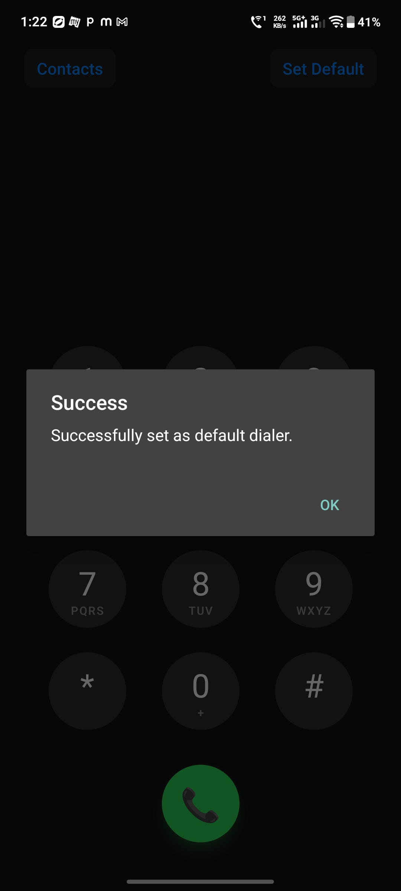
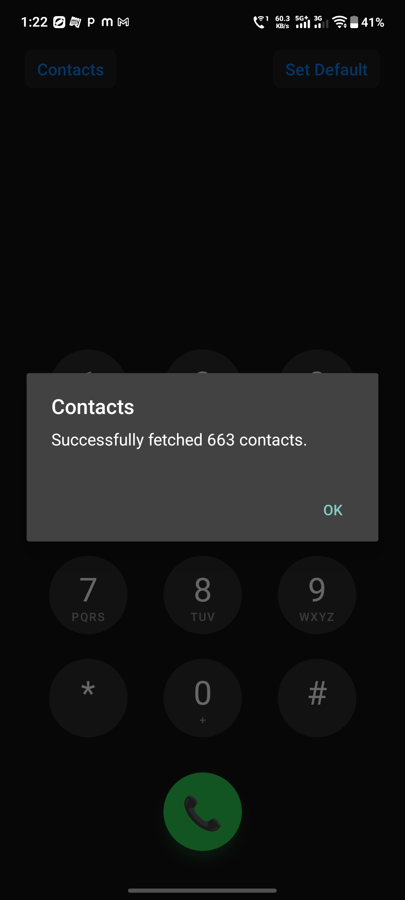
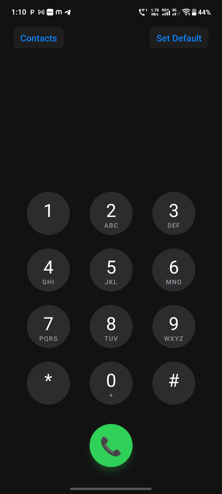
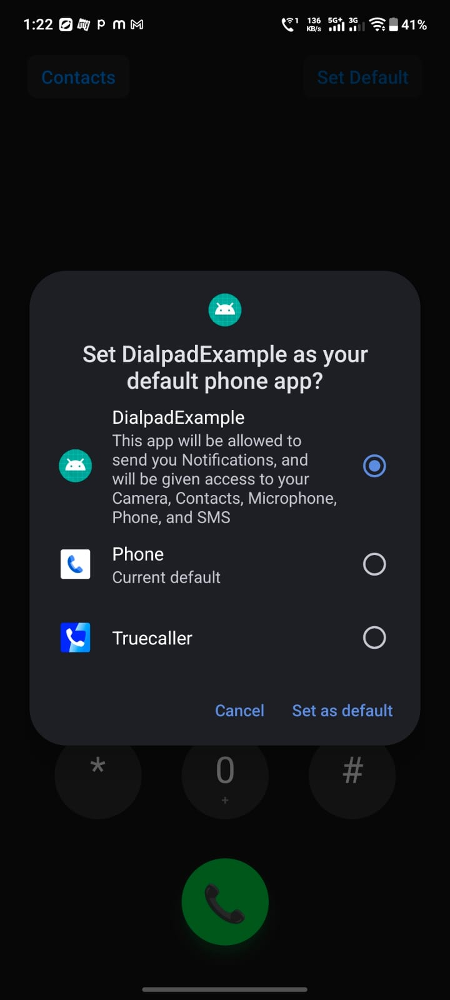

# react-native-dialpad

A powerful, native dialer and call management library for React Native.

`react-native-dialpad` allows you to create fully-functional dialer applications, request default dialer system roles, fetch and manage contacts, and handle native Telecom/InCallService routing seamlessly.

## Features
- **Native Call UI**: Hooks directly into Android's `InCallService` for native incoming/outgoing call screens.
- **Telecom Integration**: Proper audio routing and microphone mute/unmute handling.
- **Default Dialer Role**: Includes methods to request the user to set your app as the default system dialer.
- **Contact Management**: Fetch all contacts, create new contacts, and manage blocked numbers.
- **Call Settings**: Toggle vibrations, secure numbers, call forwarding, and quick reply management.

## Screenshots

| Incoming Call | Dialing | Call Actions |
| :---: | :---: | :---: |
|  |  |  |
|  |  |  |

---

## Installation

```sh
npm install react-native-dialpad
# or
yarn add react-native-dialpad
```

## Android Setup

To use this library as a default dialer, you **must** configure your Android Manifest properly.

### 1. Modify `AndroidManifest.xml`

Open `android/app/src/main/AndroidManifest.xml` and ensure you have the following permissions:

```xml
<manifest xmlns:android="http://schemas.android.com/apk/res/android">

  <!-- Required Permissions for Dialer Functionality -->
  <uses-permission android:name="android.permission.CALL_PHONE" />
  <uses-permission android:name="android.permission.READ_CONTACTS" />
  <uses-permission android:name="android.permission.WRITE_CONTACTS" />
  <uses-permission android:name="android.permission.MANAGE_OWN_CALLS" />
  <uses-permission android:name="android.permission.READ_CALL_LOG" />
  <uses-permission android:name="android.permission.WRITE_CALL_LOG" />

  <application ...>
    <activity
      android:name=".MainActivity"
      android:exported="true">
      
      <!-- Standard Launcher Intent -->
      <intent-filter>
          <action android:name="android.intent.action.MAIN" />
          <category android:name="android.intent.category.LAUNCHER" />
      </intent-filter>

      <!-- REQUIRED: Intent filter to qualify as a system dialer -->
      <intent-filter>
          <action android:name="android.intent.action.DIAL" />
          <category android:name="android.intent.category.DEFAULT" />
      </intent-filter>
      
      <!-- Intent filter for handling tel: links -->
      <intent-filter>
          <action android:name="android.intent.action.DIAL" />
          <category android:name="android.intent.category.DEFAULT" />
          <data android:scheme="tel" />
      </intent-filter>

    </activity>
  </application>
</manifest>
```

---

## Usage

### 1. Request Default Dialer Role

Before making calls through your custom UI, your app should be set as the default dialer.

```tsx
import { requestRole } from 'react-native-dialpad';

const askForDialerRole = async () => {
  try {
    const result = await requestRole();
    if (result === 'Role granted') {
      console.log('App is now the default dialer!');
    }
  } catch (error) {
    console.error('User declined or request failed', error);
  }
};
```

### 2. Make a Call

You must ensure you have requested runtime permissions (`CALL_PHONE`) before calling this method.

```tsx
import { makeCall } from 'react-native-dialpad';
import { PermissionsAndroid } from 'react-native';

const handleMakeCall = async (phoneNumber) => {
  const granted = await PermissionsAndroid.request(
    PermissionsAndroid.PERMISSIONS.CALL_PHONE
  );
  
  if (granted === PermissionsAndroid.RESULTS.GRANTED) {
    try {
      await makeCall(phoneNumber);
    } catch (e) {
      console.error('Call failed:', e);
    }
  }
};
```

### 3. Fetch Contacts

Ensure you have requested the `READ_CONTACTS` permission at runtime.

```tsx
import { getAllContacts } from 'react-native-dialpad';

const fetchContacts = async () => {
  try {
    const contacts = await getAllContacts();
    console.log(`Fetched ${contacts.length} contacts!`);
  } catch (err) {
    console.error('Failed to fetch contacts', err);
  }
};
```

## Available API Methods

| Method | Description | Return Type |
|---|---|---|
| `requestRole()` | Prompts user to set app as default dialer | `Promise<string>` |
| `makeCall(phone)` | Initiates a telecom call to the given number | `Promise<string>` |
| `getAllContacts()` | Returns a list of the device's contacts | `Promise<Array<Contact>>` |
| `createNewContact(contact)`| Creates a new contact entry | `Promise<string>` |
| `isNumberBlocked(phone)` | Checks if a number is blocked | `Promise<boolean>` |
| `addBlockedNumber(phone)`| Blocks the specified phone number | `Promise<string>` |

## Contributing

See the [contributing guide](CONTRIBUTING.md) to learn how to contribute to the repository and the development workflow.

## License

MIT

---

Made with [create-react-native-library](https://github.com/callstack/react-native-builder-bob)
